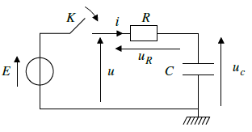
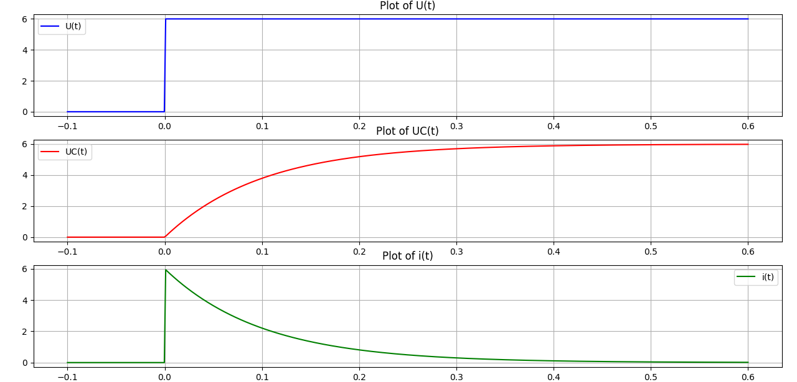

---
tags:
  - Physical signals
---

# First order linear circuit

## Response of a series RC circuit to a voltage step

We will consider the response of a series association {ohmic conductor, capacitor}
which is “suddenly” subjected to a constant voltage E.
The capacitor is initially discharged, and the switch is closed at t = 0.

### Electrical assembly



### Experimental results

We carry out a first experiment with R = 1.0 kΩ, C = 100 μF and E = 6.0V.

We simulate the results using a python script:

```
import numpy as np
import matplotlib.pyplot as plt

# Define the functions
def U(x):
    return np.where(x < 0, 0, 6)

def UC(x):
    return np.where(x < 0, 0, 6*(1-np.exp(-x/0.1)))

def i(x):
    return np.where(x < 0, 0, 6*np.exp(-x/0.1))

# Generate x values
t = np.linspace(-0.1, 0.6, 500)

# Generate y values for each function
y_U = U(t)
y_UC = UC(t)
y_i = i(t)

# Create subplots
fig, axes = plt.subplots(3, 1, figsize=(8, 10))

# Plot U(x)
axes[0].plot(t, y_U, label='U(t)', color='blue')
axes[0].set_title('Plot of U(t)')
axes[0].grid(True)
axes[0].legend()

# Plot UC(x)
axes[1].plot(t, y_UC, label='UC(t)', color='red')
axes[1].set_title('Plot of UC(t)')
axes[1].grid(True)
axes[1].legend()

# Plot i(x)
axes[2].plot(t, y_i, label='i(t)', color='green')
axes[2].set_title('Plot of i(t)')
axes[2].grid(True)
axes[2].legend()

# Adjust layout
plt.tight_layout()

# Show plot
plt.show()
```



The voltage u<sub>c</sub> is continuous at t = 0, the capacitor charges, the voltage
increases until reaching a constant value equal to E.

The intensity of the current i is discontinuous at t = 0; starting from a maximum value
at t = 0<sup>+</sup>, the intensity decreases to zero once the capacitor is charged.

We distinguish the steady state, once the quantities do not depend
plus time (here for t > 0.5 s) and the transient regime between the initial instant
and the steady state.

### Differential equation verified by uc(t)

We are interested in the evolution of the circuit, once the switch is closed, ∀t > 0.

- Loi d’additivité des tensions : <span style="color: #008080">u = E = u<sub>R</sub> + u<sub>c</sub></span>

- Caractéristiques des dipôles : <span style="color: #008080">u<sub>R</sub> = Ri</span>

and 


So, ∀t > 0, 

