---
tags:
  - Physical signals
---

# Electrical circuits in the quasistatic approximation

## Quasistatic approximation

In the quasistatic approximation, any variation in the source is immediately reflected to all
the points of the circuit.

<u>Validity scope</u>:

The quasistatic approximation consists of neglecting the
duration of propagation of the signal with respect to the characteristic evolution time
physical quantities.

Thus, in electrokinetics, we consider
that the intensity of the current is the same at every point of a wire, neglecting in the
propagation time.

## Electrical quantities

### Electric current

The electric current is associated with the macroscopic movement of the carriers of
charge, electrons in the case of a metal.

The intensity of the current, denoted i, is a charge rate equal to the electrical charge
which passes through a section of the wire per unit of time:

with i the intensity in amperes (A), dq the elementary charge in coulombs (C) and dt
the elementary duration in second (s).

<u>Note</u>: in the case of a steady state, we will note I = Q/T.

<u>Measurement of electric current intensity:</u>

The intensity of the electric current is measured using an ammeter placed in
series on the wire.

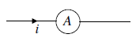

- In signal electronics, current intensities are of the order of tens of mA.

- For household appliances (bulb, kettle, etc.), intensities vary from 1 to 10 A.

- In electrical engineering, intensities can reach much higher values high (1000 A for a TGV engine).

### Electrical voltage

Each point of the circuit is characterized by an electrical state: the electric potential.

The electric voltage, denoted uAB, is equal to the electric potential difference between A and B.

uAB = VA - VB

with VA and VB the potentials in A and B. All these quantities are expressed in volts (V).

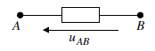

Note: uBA =  VB - VA = - (VA -  VB) = - uAB

<u>Measurement of electrical voltage</u>:

The electrical voltage is measured using a voltmeter placed in parallel to the
terminals of the dipole.

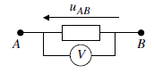

### Kirchhoff's laws

#### Kirchhoff's Current Law

A node designates an electrical branch, the meeting of at least three wires.

In an electrical node, the sum of the intensities of the currents entering is equal to the sum of the intensities of the outgoing currents.

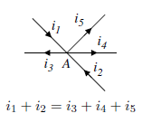

<u>Proof</u>:

dq1 + dq2 = dq3 + dq4 + dq5

Now divide by dt and you obtain:

i1 + i2 = i3 + i4 + i5

The law of nodes reflects the conservation of the electric charge of an isolated system.

#### Kirchhoff's Voltage Law

A mesh is a loop without branches through which a current flows.

The sum of tensions along an oriented mesh is zero.

uAB + uBC + uCD + uDA = 0

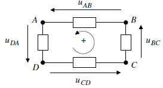

<u>Proof</u>:

uAB + uBC + uCD + uDA = (VA - VB) + (VB - VC) + (VC - VD) + (VD - VA) = 0

By using this, you obtain:

uAC = uAB + uBC

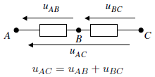

### Orientation conventions

Two conventions exist for studying a dipole:

- receiver agreement

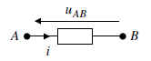

- generator convention

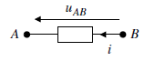

A dipole is entirely specified by its characteristic, i.e. the relation
uAB = uAB(i) for a given convention.

### Electrical power received

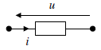

A dipole in receiver convention traversed by a current of intensity i and subjected
at a voltage u receives an electric power:

P = u x i

Power is expressed in watts (W).

## Electric dipoles

In electricity, a dipole is an element which has two terminals, the current between
through one terminal and exits through the other.

### The ohmic conductor

An ohmic conductor is a dipole for which the applied voltage is proportional
to the intensity of the current passing through it.

uAB = R x i

R is the resistance of the ohmic conductor and is expressed in ohm (Ω).

Power received: P = R x i2

Indeed, with u = R x i in receiver convention, P = u x i = R x i x i = R x i2. This power, always positive, is dissipated by the Joule effect.

<u>Note</u>: an electric wire can be compared to an ohmic resistance conductor
zero, consequently the voltage across a wire is zero.

### Ideal voltage generator

The ideal voltage generator maintains a constant voltage at its terminals and
this regardless of the intensity delivered.

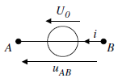

<u>Power received</u>: we must return to a receiver convention
P = uBA x i = - uAB x i = - U0 x i  < 0 for i > 0

The ideal voltage generator provides power Pp = U0 x i .

### Real voltage generator, Thévenin model

The Thévenin model corresponds to the series association of an ideal generator of
voltage and an ohmic conductor of resistance r, called internal resistance.

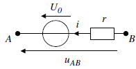

uAB = U0 - r x i 

### The capacitor

The capacitor is made up of two metal plates separated by an insulator
electric.

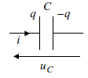

With i the intensity, q the charge of the capacitor in coulomb (C), uc the voltage at
terminals of the capacitor, and C the capacitance of the capacitor in farad (F), the laws
electrical are written:

q = C x uc 

and
 

so

The capacitance C of a capacitor represents its ability to store charges
for a given voltage across its terminals.
The farad is a “huge” unit. Commonly used abilities are often
closer to F, 1 mF already being a significant capacity.

<u>Electrostatic energy stored in a capacitor</u>:

<u>Consequence</u>: energy cannot appear or disappear spontaneously,
The voltage across a capacitor is a continuous quantity.

### The electrical coil

A coil is created using a coiled electrical wire. This winding gives
the coil's magnetic properties.

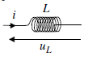

In receiver convention, the voltage across a coil and the intensity of the
current circulating in the coil are connected by the following law:

L, the inductance of the coil, is expressed in henry (H). It represents the ability of the coil to resist current variations.

<u>Real coil</u>: the long winding length gives the coil character
resistive, a real coil is therefore represented by the series association of a
inductance L and a resistance r:

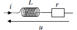

<u>Magnetic energy stored in a coil</u>:

<u>Consequence</u>: energy cannot appear or disappear spontaneously,
The current flowing through a coil is a continuous quantity.